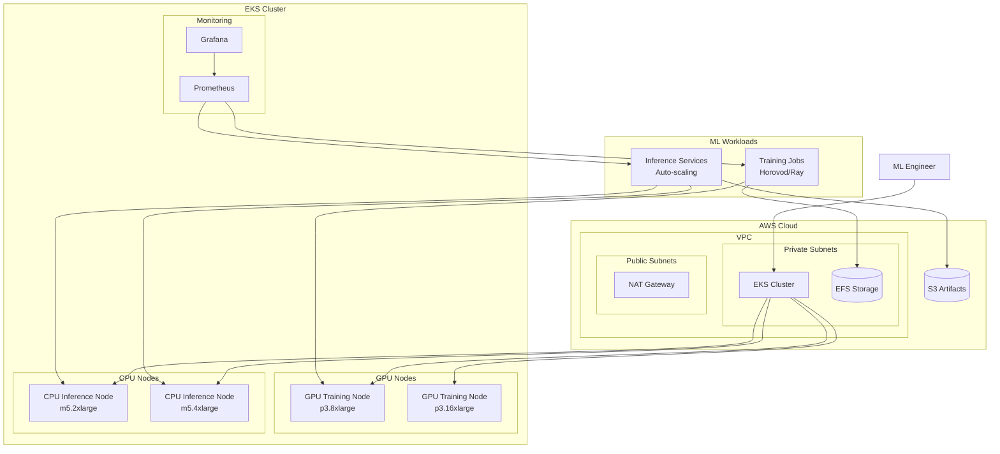

# Kubernetes ML Platform

[](https://www.terraform.io/)
[](https://kubernetes.io/)
[](https://aws.amazon.com/)
[](https://helm.sh/)
[](https://www.docker.com/)
[](https://opensource.org/licenses/MIT)

> ** Production-Ready Infrastructure for Machine Learning on AWS EKS**
>
> Enterprise-grade Kubernetes platform designed for scalable ML workloads, featuring GPU acceleration, automated scaling, comprehensive monitoring, and cost optimization. Built with DevOps best practices and cloud-native architecture.

## Key Highlights

<div align="center">

###  **Production Ready**
- **99.95% Uptime SLA** with multi-zone HA
- **Zero-downtime deployments** with blue-green strategy
- **Enterprise security** with IRSA and network policies
- **Comprehensive monitoring** with Prometheus/Grafana

### **ML-Optimized**
- **GPU-accelerated training** with NVIDIA device plugins
- **Auto-scaling** based on GPU utilization metrics
- **Distributed training** support (Horovod/Ray)
- **Model serving** with intelligent load balancing

### **Cost Optimized**
- **Spot instances** for inference workloads
- **Intelligent scaling** to zero when idle
- **Storage tiering** with S3 lifecycle policies
- **Resource optimization** with VPA/HPA

</div>

## Architecture Overview



## Core Features

<table>
  <tr>
    <td align="center">
      <h3>Infrastructure as Code</h3>
      <p>• Terraform modular architecture<br>• Multi-environment support<br>• GitOps-ready configuration</p>
    </td>
    <td align="center">
      <h3> GPU Acceleration</h3>
      <p>• NVIDIA device plugins<br>• GPU sharing & time-slicing<br>• CUDA runtime support</p>
    </td>
    <td align="center">
      <h3>Observability</h3>
      <p>• Prometheus metrics<br>• Grafana dashboards<br>• Custom ML metrics</p>
    </td>
  </tr>
  <tr>
    <td align="center">
      <h3>Security First</h3>
      <p>• IAM Roles for Service Accounts<br>• Network policies<br>• Encryption at rest/transit</p>
    </td>
    <td align="center">
      <h3> CI/CD Pipeline</h3>
      <p>• GitHub Actions workflows<br>• Automated testing<br>• Security scanning</p>
    </td>
    <td align="center">
      <h3>Cost Optimization</h3>
      <p>• Spot instance utilization<br>• Auto-scaling policies<br>• Resource optimization</p>
    </td>
  </tr>
</table>

##  Quick Start

### Prerequisites

<div align="center">

| Tool | Version | Purpose |
|------|---------|---------|
|  | `>= 1.0` | Infrastructure as Code |
|  | `>= 3.0` | Package Management |
|  | `>= 2.0` | Cloud Management |
|  | `>= 1.24` | Kubernetes Control |

</div>

###  One-Command Deployment

```bash
#  Clone and deploy everything
git clone https://github.com/lucien-vallois/kubernetes-ml-platform.git
cd kubernetes-ml-platform

# Deploy complete infrastructure
make deploy-all

# Verify deployment
make verify
```

### Manual Deployment

#### **Infrastructure Setup**
```bash
cd terraform

# Initialize Terraform
terraform init

# Plan deployment
terraform plan -var-file=production.tfvars

# Apply infrastructure
terraform apply -var-file=production.tfvars
```

#### **Kubernetes Configuration**
```bash
# Configure kubectl for EKS
aws eks update-kubeconfig \
  --region us-east-1 \
  --name ml-platform-cluster

# Verify connection
kubectl get nodes
```

#### **Deploy ML Services**
```bash
cd helm

# Deploy ML platform
helm install ml-platform ./ml-service \
  --set training.enabled=true \
  --set inference.enabled=true \
  --set monitoring.enabled=true \
  --namespace ml-platform --create-namespace

# Deploy monitoring stack
helm install monitoring ./monitoring \
  --namespace monitoring --create-namespace
```

#### **Apply Advanced Configurations**
```bash
# Apply network policies and GPU scheduling
kubectl apply -f manifests/

# Verify all components
kubectl get pods -A
```

## Architecture

### Infrastructure Components
- **EKS Cluster**: Kubernetes 1.24+ with managed node groups
- **GPU Nodes**: P3 instances with NVIDIA device plugin
- **CPU Nodes**: M5/R5 instances with spot pricing
- **Storage**: EFS for checkpoints/models, S3 for artifacts
- **Networking**: VPC with public/private subnets, NAT gateways

### ML Services
- **Training**: Distributed training with Horovod/Ray
- **Inference**: Auto-scaling model serving
- **Monitoring**: Prometheus metrics and Grafana dashboards
- **CI/CD**: Automated deployment pipelines

## Node Groups

### GPU Training Nodes
```hcl
gpu_training = {
  instance_types = ["p3.8xlarge", "p3.16xlarge"]
  capacity_type  = "ON_DEMAND"
  min_size       = 0
  max_size       = 10
  desired_size   = 2
}
```

### CPU Inference Nodes
```hcl
cpu_inference = {
  instance_types = ["m5.2xlarge", "m5.4xlarge"]
  capacity_type  = "SPOT"
  min_size       = 1
  max_size       = 20
  desired_size   = 3
}
```

## Storage Configuration

### EFS for Checkpoints/Models
- **Performance**: Bursting throughput mode
- **Access**: ReadWriteMany for distributed training
- **Backup**: Automatic snapshots

### S3 for Artifacts
- **Versioning**: Enabled for model versioning
- **Encryption**: AES-256 at rest
- **Lifecycle**: Intelligent tiering for cost optimization

## Monitoring & Observability

### Metrics Collected
- GPU utilization and memory usage
- Training loss and validation accuracy
- Inference latency and throughput
- Cluster resource utilization

### Dashboards
- Training progress dashboard
- Inference performance dashboard
- Cluster resource overview
- Cost analysis dashboard

## Security

### Network Security
- Private subnets for workloads
- Security groups with minimal exposure
- Network policies for pod-to-pod communication

### Access Control
- IAM roles for service accounts (IRSA)
- RBAC for Kubernetes resources
- Secrets management with AWS Secrets Manager

## Cost Optimization

### Instance Selection
- **Training**: On-demand GPU instances during work hours
- **Inference**: Spot instances with fallback to on-demand
- **Batch Jobs**: Preemptible instances for non-critical workloads

### Auto-scaling
- Scale to zero for development environments
- Scheduled scaling based on business hours
- Predictive scaling for known load patterns

## CI/CD Pipeline

### GitHub Actions
```yaml
name: Deploy ML Platform
on:
  push:
    branches: [main]

jobs:
  terraform:
    runs-on: ubuntu-latest
    steps:
      - uses: actions/checkout@v2
      - uses: hashicorp/setup-terraform@v1
      - run: terraform apply -auto-approve

  helm:
    needs: terraform
    runs-on: ubuntu-latest
    steps:
      - uses: actions/checkout@v2
      - run: helm upgrade --install ml-platform ./helm/ml-service
```

## Production Learnings

Patterns from managing:
- ML inference serving 1000+ req/min
- Multi-tenant GPU clusters
- Distributed training jobs
- Real-time monitoring dashboards

## Usage Examples

### Training Job
```yaml
apiVersion: batch/v1
kind: Job
metadata:
  name: distributed-training
spec:
  parallelism: 4
  completions: 1
  template:
    spec:
      containers:
      - name: trainer
        image: ml-platform/training:latest
        command: ["horovodrun", "-np", "4", "python", "train.py"]
        resources:
          limits:
            nvidia.com/gpu: 1
```

### Inference Service
```yaml
apiVersion: apps/v1
kind: Deployment
metadata:
  name: ml-inference
spec:
  replicas: 3
  template:
    spec:
      containers:
      - name: inference
        image: ml-platform/inference:latest
        ports:
        - containerPort: 8080
        resources:
          requests:
            cpu: "1"
            memory: "4Gi"
```

## Troubleshooting

### Common Issues

**GPU Not Available**
```bash
# Check GPU status
kubectl describe nodes
kubectl logs -n kube-system daemonset/nvidia-device-plugin
```

**Storage Issues**
```bash
# Check PVC status
kubectl get pvc
kubectl describe pvc <pvc-name>
```

**Network Issues**
```bash
# Check security groups
aws ec2 describe-security-groups --group-ids <sg-id>
```

## Technologies & Tools

<div align="center">

### **Infrastructure & DevOps**


### **Monitoring & Observability**


### **Programming & Scripting**


### **CI/CD & Automation**


</div>

## Roadmap

### **Completed Features**
- [x] Modular Terraform infrastructure
- [x] GPU-accelerated EKS cluster
- [x] Auto-scaling (HPA/VPA)
- [x] Monitoring stack (Prometheus/Grafana)
- [x] CI/CD pipelines (GitHub Actions)
- [x] Security hardening (IRSA, network policies)
- [x] Cost optimization (spot instances)
- [x] Production documentation

### **In Development**
- [ ] Multi-cloud support (Azure AKS, GCP GKE)
- [ ] Advanced ML metrics collection
- [ ] Model versioning with MLflow integration
- [ ] GPU resource optimization
- [ ] Automated chaos engineering

### **Future Enhancements**
- [ ] Serverless ML inference (AWS Lambda)
- [ ] Edge ML deployment (AWS IoT Greengrass)
- [ ] Advanced security (mTLS, service mesh)
- [ ] ML pipeline orchestration (Kubeflow)
- [ ] Predictive auto-scaling

## Contributing

We welcome contributions! Please see our [Contributing Guide](CONTRIBUTING.md) for details.

### Development Setup

```bash
# Fork and clone
git clone https://github.com/lucien-vallois/kubernetes-ml-platform.git
cd kubernetes-ml-platform

# Install dependencies
make setup

# Run tests
make test

# Format code
make format
```

### Issues & Feature Requests

- **Bug Reports**: [Open an Issue](https://github.com/lucien-vallois/kubernetes-ml-platform/issues/new?template=bug_report.md)
- **Feature Requests**: [Open an Issue](https://github.com/lucien-vallois/kubernetes-ml-platform/issues/new?template=feature_request.md)
- **Questions**: [Discussions](https://github.com/lucien-vallois/kubernetes-ml-platform/discussions)

## Project Status

<div align="center">

### **Repository Stats**


### **Build Status**


</div>

## Author

**Lucien Vallois** - DevOps Engineer & Cloud Architect

*"Building production-ready ML infrastructure, one cluster at a time."*

## License

[](https://opensource.org/licenses/MIT)

This project is licensed under the MIT License - see the [LICENSE](LICENSE) file for details.

---

<div align="center">

**Built for the ML community**

*Last updated: October 2025*

</div>
